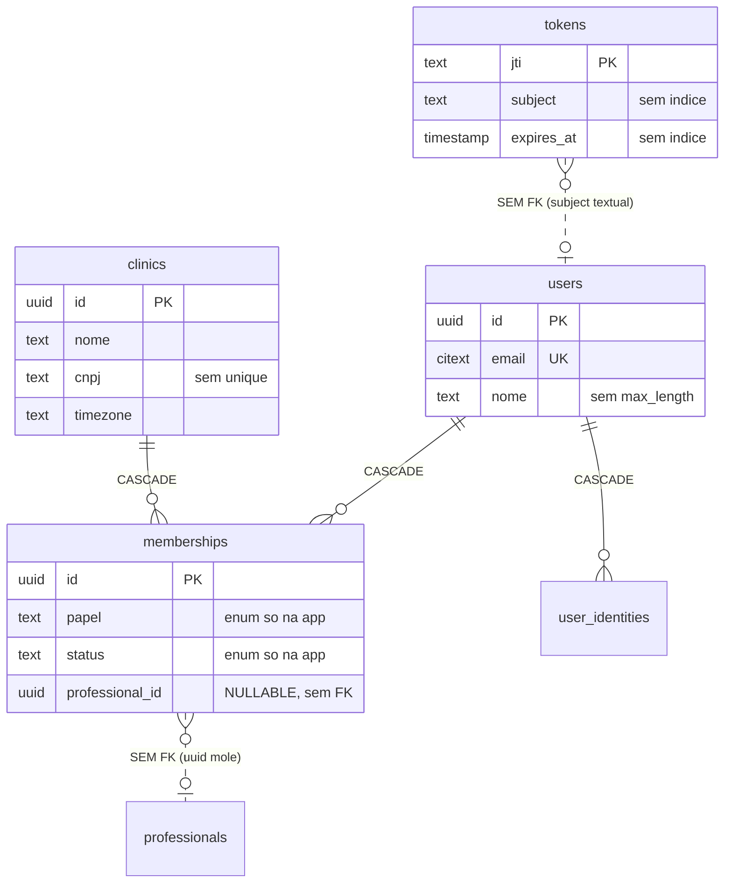
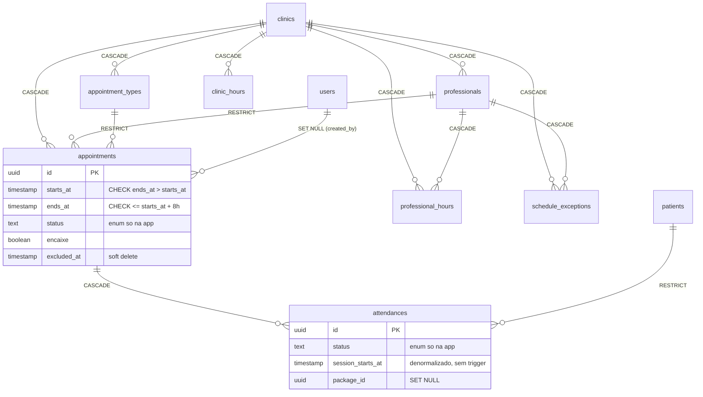
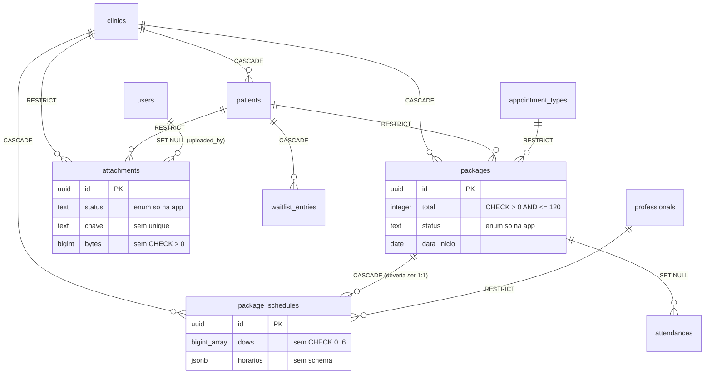
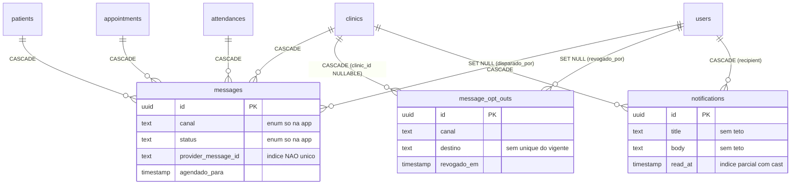
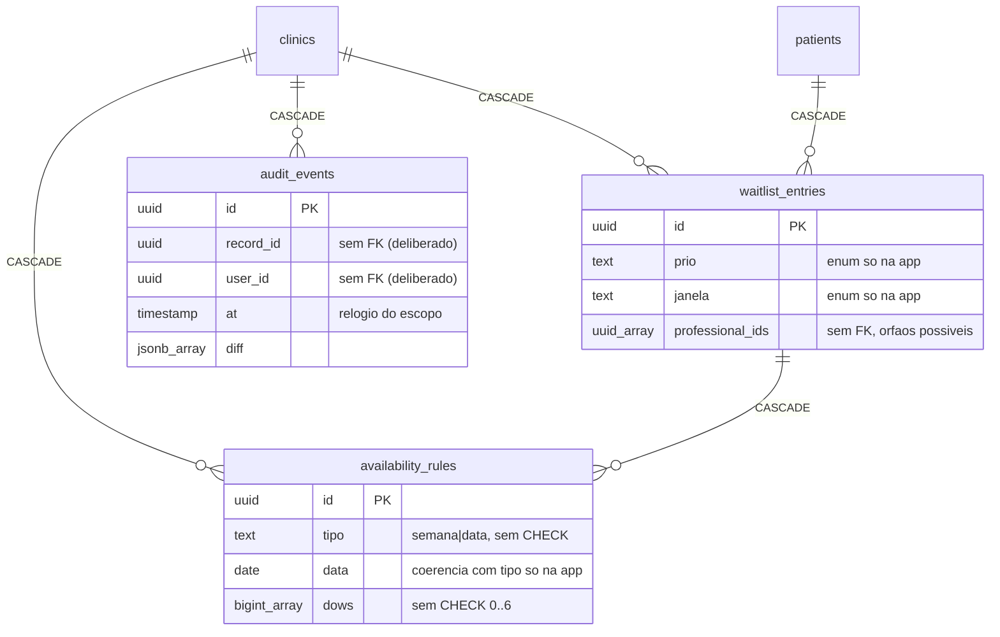

# Auditoria do banco de dados — 2026-07-30

Alvo: **o schema inteiro** — 22 recursos Ash com `AshPostgres.DataLayer`, 25 tabelas, 71 migrations,
13 views `metrics_*`, 42 foreign keys, 88 índices, 17 policies de RLS.

Sondado contra o banco de dev rodando (`cinetra-db-1`, PostgreSQL 16.14), como `postgres` **e** como
`cinetra_app`. Nenhuma linha de código de produção e nenhuma migration foi tocada: isto é
diagnóstico. Todo SQL proposto está no documento como proposta, não aplicado.

**Veredicto curto: o schema está em bom estado.** Não há achado P0. A disciplina de indexação é
real — zero índice redundante em 88, e as quatro FKs sem índice liderando já estão declaradas como
débito ([D-2](50-debitos-tecnicos.md)) com a justificativa medida. O que esta auditoria acrescenta
são **14 itens**, 5 importantes e 9 de melhoria, quase todos na mesma família: *o banco quase não
tem opinião própria — ele confia que a escrita passou pelo Ash.*

---

## 1. Como foi medido, e o que não deu para medir

O container do banco foi subido para esta auditoria (`docker compose up -d db`). Isso tem uma
consequência que muda o que o documento pode afirmar:

```
 total_idx_scan | total_seq_scan | tabelas
----------------+----------------+---------
              0 |              0 |      25

 indices_com_scan_gt0
----------------------
                    0
```

**Os contadores cumulativos foram perdidos no restart.** `pg_stat_database.stats_reset` vem vazio,
`n_live_tup` é 0 em todas as 25 tabelas e `last_autoanalyze` é nulo em todas — o PostgreSQL 15+
mantém as estatísticas em memória e só as persiste em desligamento limpo. Logo:

> **Não é possível, nesta rodada, apontar índice morto.** "Índice não usado" é uma afirmação que só
> se sustenta sobre um contador com tempo de vida longo — e o que existe aqui tem 56 segundos.
> Qualquer lista de "índices para derrubar" produzida a partir deste banco seria ficção.

O que **foi** possível medir, e que não depende de contador:

- estrutura completa (tabelas, colunas, tipos, defaults, nulabilidade, FKs, constraints, policies);
- **planos de execução reais** (`EXPLAIN`) para as queries que importam, com `enable_seqscan=off`
  quando o volume de dev era pequeno demais para o planejador escolher índice sozinho;
- **experimentos com rollback**: criar um índice hipotético, medir o plano, `ROLLBACK`. Nada
  persistiu — conferido depois de cada um.

A seção [§10](#10-o-que-ficou-não-verificado) lista o que ficou de fora e como fechá-lo.

---

## 2. Mapa das tabelas

Contagem exata (`select count(*)`), não `reltuples` — que vinha `-1` em 11 tabelas por nunca terem
sido analisadas nesta instância.

| Tabela | Propósito | Por tenant | Linhas | Total | RLS |
| --- | --- | --- | ---: | ---: | :---: |
| `clinic_hours` | Expediente da clínica, uma linha por dia da semana | sim | 2.891 | 728 kB | ✅ |
| `appointment_types` | Tipos de atendimento (nome, cor, duração, turma) | sim | 2.066 | 664 kB | ✅ |
| `audit_events` | Trilha de auditoria, append-only, retenção 90 d | sim | 1.923 | 1.752 kB | ✅ |
| `tokens` | Tokens do AshAuthentication (PK textual `jti`) | **não** | 943 | 648 kB | ❌ |
| `patients` | Ficha do paciente | sim | 564 | 736 kB | ✅ |
| `oban_jobs` | Fila de jobs | não | 486 | 488 kB | ❌ |
| `users` | Usuário global (e-mail `citext` único) | **não** | 447 | 328 kB | ❌ |
| `memberships` | Vínculo usuário↔clínica + papel | **atravessa** | 446 | 384 kB | **❌** |
| `clinics` | Registry de tenants | raiz | 413 | 328 kB | ❌ |
| `professionals` | Cadastro de profissionais | sim | 387 | 408 kB | ✅ |
| `attendances` | Presença por participante | sim | 254 | 296 kB | ✅ |
| `appointments` | Bloco da agenda | sim | 234 | 336 kB | ✅ |
| `notifications` | Caixa do sino, por destinatário | sim | 56 | 120 kB | ✅ |
| `messages` | Comunicação com o paciente (e-mail/WhatsApp) | sim¹ | 24 | 160 kB | ✅ |
| `professional_hours` | Grade semanal do profissional | sim | 8 | 64 kB | ✅ |
| `packages` | Pacote de N sessões | sim | 3 | 64 kB | ✅ |
| `package_schedules` | Grade do pacote (dias/horários) | sim | 3 | 64 kB | ✅ |
| `waitlist_entries` | Fila de espera | sim | 1 | 64 kB | ✅ |
| `user_identities` | Identidade OAuth (Google) | **não** | 1 | 64 kB | ❌ |
| `attachments` | Anexos da ficha (metadado; objeto no R2) | sim | 0 | 80 kB | ✅ |
| `availability_rules` | Regras de disponibilidade da fila | sim | 0 | 32 kB | ✅ |
| `message_opt_outs` | Descadastro de comunicação | sim/global² | 0 | 40 kB | ✅ |
| `schedule_exceptions` | Feriado / exceção de horário | sim | 0 | 32 kB | ✅ |
| `oban_peers` | Liderança do Oban | não | 0 | 32 kB | ❌ |
| `schema_migrations` | Controle do Ecto | não | 71 | 24 kB | ❌ |

¹ `messages` tem `global? true` no Ash — o webhook chega sem clínica. A contenção é a RLS, que abre
duas portas por GUC de uso único (`cinetra.provider_message_id`, `cinetra.message_id`).
² `message_opt_outs` aceita `clinic_id IS NULL` (descadastro global); a policy reflete isso.

**17 tabelas por tenant, 17 policies de RLS, todas com `FORCE`** — nenhuma tabela com RLS ligada
esqueceu o `FORCE`, e nenhuma tabela com `clinic_id` ficou sem policy, com **uma exceção**:

```
=== tabelas por-tenant SEM rls ===
   relname   | relrowsecurity
-------------+----------------
 memberships | f
```

`memberships` é a única. É **deliberado e correto**: é a tabela que responde *"de quais clínicas
este usuário faz parte?"*, pergunta que precisa ser respondida **antes** de existir um tenant para
pôr na GUC. Ligar RLS nela criaria um ciclo. O isolamento dela é policy do Ash
(`membership.ex:123-158`), sem segunda camada — registrado aqui como fato arquitetural, não como
defeito.

**Views `metrics_*` (13) atravessam clínicas por construção:**

```
=== views metrics_*: security_invoker ligado? ===
          relname          | reloptions
---------------------------+------------
 metrics_professionals     |            ← nenhuma opção: security_invoker = false

=== metrics_professionals atravessa clinicas? ===
 clinicas_visiveis | linhas
-------------------+--------
               383 |    387
```

Sem `security_invoker`, a view roda com os direitos do dono e **contorna o `FORCE ROW LEVEL
SECURITY`**. Isso é a decisão documentada (doc 05 §1.3, doc 77): o que limita o abuso não é a RLS,
é a lista de colunas de cada view mais o `GRANT SELECT` restrito ao role `cinetra_metrics`. A
consequência prática, que vale repetir porque é contraintuitiva: **acrescentar uma coluna a uma
view `metrics_*` não é protegido pelo isolamento por clínica.** Não é achado novo — é o contrato
vigente, e ele foi conferido.

---

## 3. Mapa dos relacionamentos

42 foreign keys. Todas com `ON UPDATE NO ACTION`, nenhuma `DEFERRABLE` — uniforme, sem exceção.

### 3.1 Contas e tenancy



Duas ligações são **pontilhadas de propósito**: elas existem no domínio e **não** existem no banco.
`memberships.professional_id` é um uuid sem FK (§5.1) e `tokens.subject` é uma string opaca
(`"user?id=..."`) sem relação declarada — apagar um usuário deixa tokens órfãos, sem cascade.

### 3.2 Agenda



A agenda é a área mais protegida do schema — é a única com `CHECK` de domínio **e** com uma
`EXCLUDE` de verdade:

```sql
EXCLUDE USING gist (professional_id WITH =, tsrange(starts_at, ends_at, '[)') WITH &&)
  WHERE (encaixe = false AND status <> 'cancelado' AND excluded_at IS NULL)
```

Sobreposição de horário do mesmo profissional é impedida **pelo banco**, não por validação. É o
melhor invariante do sistema.

### 3.3 Pacientes, pacotes e anexos



`attachments` é o **único** recurso que usa `RESTRICT` em vez de `CASCADE` para `clinic`/`patient`,
e a razão é boa: um `CASCADE` apagaria a linha dentro do Postgres sem passar por
`Api.Storage.delete/1`, deixando o laudo órfão no bucket R2 — invisível a qualquer policy.
`RESTRICT` obriga a remoção a passar pela aplicação.

A cardinalidade `packages ||--o{ package_schedules` está desenhada como 1:N porque **é assim que o
banco a define hoje** — o domínio a declara como `has_one`. Ver §5.2.

### 3.4 Mensageria e notificações



### 3.5 Fila de espera e auditoria



`audit_events.record_id` e `user_id` **sem FK é decisão consciente** (`event.ex:24-33`): a trilha
precisa sobreviver ao registro que descreve. Uma FK com `CASCADE` apagaria a prova junto com o
fato; com `RESTRICT`, impediria apagar. Ambas erradas para uma trilha. Está certo como está.

---

## 4. Índices

88 índices. Duas notícias boas antes das ressalvas.

**Zero índice redundante.** A consulta que procura índice cujas colunas sejam prefixo estrito de
outro (mesma tabela, ambos não-únicos, ambos sem predicado parcial) devolveu vazio:

```
=== indices que sao PREFIXO estrito de outro ===
 tabela | redundante | cols_a | coberto_por | cols_b
--------+------------+--------+-------------+--------
(0 rows)
```

Num schema de 88 índices construído por 71 migrations, isso é incomum e reflete curadoria — vários
comentários no código documentam remoções deliberadas (`attendance.ex:64-75` derruba
`(clinic_id, appointment_id)` por ser prefixo estrito da identity).

**Cobertura de FK: 38 de 42.** As 4 que faltam são exatamente as de [D-2](50-debitos-tecnicos.md):

```
                fk                 |      tabela       |      cols      | on_delete
-----------------------------------+-------------------+----------------+-----------
 attendances_patient_id_fkey       | attendances       | patient_id     | RESTRICT
 attendances_appointment_id_fkey   | attendances       | appointment_id | CASCADE
 package_schedules_package_id_fkey | package_schedules | package_id     | CASCADE
 packages_patient_id_fkey          | packages          | patient_id     | RESTRICT
```

Bate **item por item** com a lista já declarada em `@sem_indice_liderando_conhecidas` no
`on_delete_test.exs`. Nada novo aqui: o débito está aberto, com a justificativa medida (o caminho
que os usaria não existe — os pais não têm ação `destroy`) e com o pagador identificado (D-1/F8).
Esta auditoria **confirma** D-2 e não o reabre.

### 4.1 O achado do índice parcial acoplado ao cast

Dois índices parciais têm um cast no predicado:

```sql
notifications_unread_index        ... WHERE ((read_at)::timestamp without time zone IS NULL)
message_opt_outs_vigentes_index   ... WHERE ((revogado_em)::timestamp without time zone IS NULL)
```

O cast não é enfeite. As colunas são `timestamp(0)` (Ash `:utc_datetime`, precisão de segundo) e o
AshPostgres emite `read_at::timestamp IS NULL`. A migration
`20260726154026_notificacoes_indice_nao_lidas_com_cast.exs` existe justamente porque alguém já
descobriu isso. **Medido, e o resultado é mais rígido do que se supõe:**

```
--- consulta SEM cast (SQL escrito a mão) ---
 Index Scan Backward using notifications_inbox_index      ← NÃO usa o índice parcial
       Filter: (read_at IS NULL)

--- consulta COM cast (a que o Ash emite) ---
 Index Scan Backward using notifications_unread_index     ← usa
```

E o inverso, com o índice recriado sem cast (dentro de transação, `ROLLBACK` ao fim):

```
--- consulta SEM cast ---  → Index Scan using teste_sem_cast          ← usa
--- consulta COM cast ---  → Index Scan using notifications_inbox_index ← NÃO usa
                                  Filter: ((read_at)::timestamp ... IS NULL)
```

**O casamento é exclusivo e bidirecionalmente cego.** O índice atual está *certo* — ele serve o
caminho do Ash, que é o único que importa em produção. O risco não é hoje; é que a ligação está
presa à forma exata do SQL que o AshPostgres emite. Um upgrade de AshPostgres/Ecto que pare de
emitir o cast **desanexa o índice em silêncio** — sem erro, sem falha de teste, só o badge do sino
degradando para filtro. Ver P2-6.

*(Corolário operacional: `EXPLAIN` digitado no `psql` sobre essas duas tabelas mente. Para saber se
o índice parcial está sendo usado, é preciso reproduzir o cast — ou medir pelo caminho da
aplicação, como manda `.claude/rules/migrations.md`.)*

### 4.2 Índices que faltam — cada um com a query que o justifica

| Índice proposto | Qual caminho serve | Evidência |
| --- | --- | --- |
| `notifications (clinic_id, inserted_at)` **+ reescrita do predicado** | `Api.Housekeeping.PruneNotifications` | §8.1 — medido; o índice **sozinho não resolve** |
| `package_schedules (clinic_id, package_id)` **UNIQUE** | integridade do `has_one :schedule` | §5.2 |
| `tokens (expires_at)` e `tokens (subject)` | `expunge_expired`, `revoke_all_stored_for_subject` | §8.2 — dois Seq Scan medidos |
| `attachments (clinic_id, inserted_at) WHERE status = 'pendente'` | `PruneAttachments` | §8.3 |
| `waitlist_entries (clinic_id, inserted_at)` | ordenação da fila | §8.4 — parcial, ver ressalva |

**Toda migration de índice aqui vale a regra do projeto**: tabela com dado pede
`CREATE INDEX CONCURRENTLY` com `@disable_ddl_transaction true` **e** `@disable_migration_lock true`
(`.claude/rules/migrations.md` §2). Das cinco propostas, `notifications` (56 linhas) e `tokens` (943)
são as únicas com volume não-trivial hoje; em produção `tokens` cresce a cada login.

---

## 5. Integridade referencial

### 5.1 `memberships.professional_id` — o único uuid mole que aponta para tabela existente

```
=== memberships: tem FK para professionals? ===
          conname           |                    pg_get_constraintdef
----------------------------+------------------------------------------------------------------
 memberships_clinic_id_fkey | FOREIGN KEY (clinic_id) REFERENCES clinics(id) ON DELETE CASCADE
 memberships_pkey           | PRIMARY KEY (id)
 memberships_user_id_fkey   | FOREIGN KEY (user_id) REFERENCES users(id) ON DELETE CASCADE
```

Não há `memberships_professional_id_fkey`. A coluna existe (`uuid`, nulável), tem índice único
`(clinic_id, professional_id)`, e **nenhuma garantia de que aponta para um profissional que existe,
muito menos da mesma clínica**.

O guarda é a validação `ProfessionalInClinic` — que está em `:invite_by_email` e `:update`, **e não
em `:invite`**:

```elixir
create :invite do
  accept [:papel, :professional_id]
  ...
  validate {Api.Accounts.Membership.Validations.RestrictOwnerInvite, []}   # só esta
end
```
`api/lib/api/accounts/membership.ex:72-80`

**Severidade, medida e não suposta.** A superfície HTTP usa `invite_member_by_email`
(`members_controller.ex:53`), que **tem** a validação; `invite_member` (`:invite`) só é alcançável
por código/teste. E o estado atual está limpo:

```
=== orfaos: memberships.professional_id sem professional ===  0
=== orfaos: professional_id aponta para OUTRA clinica?  ===  0
```

Então: **não é buraco vivo, é armadilha latente** — uma ação sem a validação, uma coluna sem FK, e
nada que force a próxima rota a escolher a porta certa. É P1 por isso, não por dano atual.

### 5.2 `has_one :schedule` sem unicidade no banco

`Api.Packages.Package` declara `has_one :schedule` e `PackageSchedule` declara
`index [:clinic_id, :package_id]` — **não-único**:

```
 package_schedules_clinic_id_package_id_index | CREATE INDEX ... USING btree (clinic_id, package_id)
```

O banco aceita duas grades para o mesmo pacote. O Ash, num `has_one`, pegaria **uma delas** — qual,
depende da ordem que o Postgres devolver. Como a grade define *para onde as sessões futuras do
pacote são reprojetadas*, uma segunda linha silenciosa é reprojeção divergente.

Hoje não há duplicata (`3 grades / 3 pacotes`), então a promoção do índice a `UNIQUE` aplica sem
conflito. É a correção mais barata da auditoria.

### 5.3 Semântica de `on_delete` — coerente

As 42 FKs seguem três padrões, e os três se justificam:

- **`CASCADE`** (29) — filho que não existe sem o pai: tudo que pende de `clinics`, `attendances`
  de `appointments`, `availability_rules` de `waitlist_entries`.
- **`RESTRICT`** (8) — pai que não pode sumir sem decisão humana: `patients`, `professionals`,
  `appointment_types` e os dois de `attachments` (§3.3).
- **`SET NULL`** (5) — autoria/vínculo informativo: `created_by`, `uploaded_by`, `disparado_por`,
  `revogado_por`, `attendances.package_id`.

Não encontrei nenhum `on_delete` que contradiga a regra de negócio. A única contradição
banco↔domínio é a de §5.2, e é de cardinalidade, não de cascade.

### 5.4 Onde o banco não pode ajudar: FKs globais sob tenancy por atributo

Todas as FKs apontam para a PK, não para `(clinic_id, id)`. Consequência estrutural: **"a referência
é da mesma clínica" nunca é garantido pelo banco** — só pela RLS na leitura e por validações de
aplicação na escrita (`PatientsInClinic`, `PackageBelongsToPatient`, `ProfessionalInClinic`,
`checar_profissional/2`).

Isso é o custo declarado do ADR-017 e não proponho reverter — FK composta exigiria `clinic_id` em
toda chave estrangeira e um índice único `(clinic_id, id)` em todo pai. Registro porque explica
por que tantas validações de tenant existem na aplicação: **elas são a única camada**, e cada ação
nova que aceita um id de outro recurso precisa lembrar disso (§5.1 é o caso onde alguém não lembrou).

---

## 6. Validações e limites: onde o banco não protege

Este é o eixo central da auditoria. O inventário de tipos:

```
=== colunas por tipo base (tabelas do dominio) ===
          data_type          | count
-----------------------------+-------
 text                        |   117
 uuid                        |    66
 timestamp without time zone |    58
 bigint                      |    16
 boolean                     |    14
 ARRAY                       |    11
 date                        |     5
 jsonb                       |     5

=== existe alguma varchar com limite? ===
 varchars_com_limite
---------------------
                   0
```

**117 colunas de texto, nenhuma com limite.** E o inventário de constraints:

```
    tabela    |               nome               |  tipo   |  definicao
--------------+----------------------------------+---------+-------------------------------------
 appointments | appointments_duration_within_cap | CHECK   | ends_at <= starts_at + '08:00:00'
 appointments | appointments_ends_after_starts   | CHECK   | ends_at > starts_at
 appointments | appointments_no_overlap          | EXCLUDE | gist (professional_id, tsrange...)
 packages     | packages_total_max               | CHECK   | total <= 120
 packages     | packages_total_positive          | CHECK   | total > 0
```

**Quatro `CHECK` de domínio e uma `EXCLUDE`, em 22 recursos.** Fora `appointments` e `packages`, o
banco não tem nenhuma opinião sobre o conteúdo. Um único tipo enum nativo existe no cluster
(`oban_job_state`) e ele é do Oban, não do projeto — todos os enums do Cinetra são `text` livre.

O que isso significa, concretamente — regras que existem **só** na aplicação:

| Regra | Onde vive | O banco replica? |
| --- | --- | --- |
| DV do CPF do paciente | `patient/validations/campo_valido.ex:49-53` | não — `text` livre |
| DV do CPF do **profissional** | **não existe em lugar nenhum** | não |
| Formato de e-mail (paciente) | `campo_valido.ex:31` | não |
| Módulo 11 do CNPJ da clínica | `clinic/validations/valid_cnpj.ex` | não — e sem `UNIQUE` |
| `nascimento` nem futuro nem < 1900 | `campo_valido.ex:61-72` | não |
| Telefone obrigatório 10/11 dígitos | `Api.Validations.TelObrigatorio` | não — coluna anulável (D6) |
| Canonicalização de CPF/tel/e-mail | `Api.Changes.Canonicalizar` | não — **e é ela que faz os índices únicos valerem** |
| Todos os `max_length` (117 colunas) | `constraints` do Ash | não |
| Todos os `min`/`max` de inteiro | `constraints` do Ash | não — `bigint` sem `CHECK` |
| Todos os enums (14 tipos) | `Ash.Type.Enum` | não |
| `dow ∈ 0..6` (clinic/professional_hours) | `constraints` do Ash | não |
| `dows ∈ 0..6` (package_schedules) | **nem no Ash** — o comentário afirma que há constraint | não |
| "capacidade presente ⟺ grupo" | `appointment_type.ex:134-135` | não |
| "≥ 1 owner por tenant" | `NotLastOwner` | não — sem trigger |
| `tipo ⟺ dows`/`data` (availability_rules) | `RuleShape` | não |
| Máquinas de estado (3 recursos) | validações `StatusIn` por ação | não |

**Isto é uma escolha de arquitetura, não um descuido** — o banco é escrito exclusivamente pelo Ash,
e duplicar cada regra em `CHECK` é custo de manutenção com duas fontes de verdade (o próprio projeto
já tem esse problema em `packages_total_max`, onde o `120` é literal no `CHECK` e reflexão no
atributo). Não proponho espelhar tudo.

O que **proponho** é distinguir dois grupos:

1. **Regra que só o Ash precisa saber** (formato de e-mail, DV de CPF, `max_length` de campo de
   endereço) — deixar como está. O `CHECK` não pagaria.
2. **Invariante estrutural que outra coisa pode quebrar** — coerência entre colunas, faixas
   fechadas, unicidade. Aqui o `CHECK`/`UNIQUE` vale, porque o custo é uma linha e o que ele
   protege é a capacidade de *confiar na leitura*.

O grupo 2, verificado contra os dados atuais (todos aplicariam sem conflito):

```
=== appointment_types: capacidade incoerente com grupo? ===
 grupo_sem_cap | nao_grupo_com_cap
---------------+-------------------
             0 |                 0
=== dow fora de 0..6? ===  clinic_hours: 0 | professional_hours: 0
```

A qualidade do dado, aliás, está boa — nenhuma sentinela de string vazia disfarçada de nulo, que é
o modo de falha clássico dos índices únicos com `NULLS DISTINCT`:

```
=== patients: nulos vs string vazia ===
 total | cpf_null | cpf_vazio | mail_null | mail_vazio | tel_null | tel_vazio
   564 |      551 |         0 |       562 |          0 |        0 |         0
```

Zero `''` em todas as colunas de identificação de `patients` e `professionals` — a
`Api.Changes.Canonicalizar` está fazendo o trabalho dela. E todos os valores de enum estão dentro
do domínio declarado (`appointments.status`, `attendances.status`, `memberships.papel/status`
conferidos um a um). **O risco dos §6 é prospectivo, não retroativo.**

---

## 7. RLS e multi-tenant

A GUC é `cinetra.clinic_id`, setada com `set_config($1, $2, true)` (escopo de transação), por três
caminhos: `Api.Repo.on_transaction_begin/1` (só leitura), `Api.Tenancy.SetTenantGuc` (escrita,
`before_action`) e `Api.Repo.with_clinic/2` (o wrapper explícito).

**O comportamento vivo, medido sob o role restrito:**

```
=== A: sem GUC, como cinetra_app ===
 professionals: 0        patients: 0
=== B: com GUC ===
 professionals: 1
```

Confirma a lição de `.claude/rules/migrations.md` §3: **sem `in_clinic/2` a RLS não levanta erro —
ela devolve zero linhas**, e o código lê isso como "não existe". É o modo de falha mais perigoso do
projeto porque é silencioso e porque `mix test` (que roda como `postgres`, `BYPASSRLS`) é cego para
ele. Nada a acrescentar à regra: ela está certa e está escrita.

**O que a auditoria acrescenta é uma inconsistência nas policies.** 15 das 17 comparam direto:

```sql
clinic_id = (current_setting('cinetra.clinic_id', true))::uuid
```

e 2 (`messages`, `message_opt_outs`) passam por `NULLIF(..., '')` antes. A diferença aparece quando
a GUC está setada como **string vazia**:

```
=== C: GUC vazia, em professionals (15 policies sem NULLIF) ===
ERROR:  invalid input syntax for type uuid: ""
=== D: GUC vazia, em messages (policy com NULLIF) ===
 messages: 0
```

Duas tabelas falham fechado e em silêncio; quinze **levantam exceção**. Isso não é teórico: é
exatamente o *"400 com `''::uuid`"* que `attachment.ex:143-148` documenta ter acontecido no servidor
real, quando um `destroy` rodou sem `on: [:destroy]` no `SetTenantGuc`. O erro apareceu; o
diagnóstico custou. Uniformizar com `NULLIF` transforma quinze exceções obscuras em quinze
resultados vazios — que é o mesmo contrato do resto do sistema.

*(Nota: "falhar barulhento" também é defensável. O ponto não é qual comportamento é melhor — é que
hoje há **dois**, sem que a diferença tenha sido decidida.)*

**Armadilha latente relacionada:** o `on:` default do Ash em `changes` é `[:create, :update]`. Só
`Attachment` declara `on: [:create, :update, :destroy]` no `SetTenantGuc`. `Professional`,
`AppointmentType`, `Patient` e `Audit.Event` usam a forma curta — inofensivo **hoje**, porque
nenhum deles expõe `destroy` (arquivam em vez de apagar). Adicionar um `destroy` a qualquer um
reproduz o bug que o `Attachment` já pagou.

---

## 8. Riscos de performance

### 8.1 A poda de notificações varre a partição inteira da clínica

`PruneNotifications` emite (via `Poda.em_lote/4`):

```sql
DELETE FROM notifications WHERE ctid IN (
  SELECT ctid FROM notifications
   WHERE clinic_id = $1
     AND ((read_at IS NOT NULL AND inserted_at < $2)
       OR (read_at IS NULL  AND inserted_at < $3))
   LIMIT 5000)
```

Plano real:

```
 Index Scan using notifications_inbox_index on notifications
   Index Cond: (clinic_id = '019fb066-...'::uuid)
   Filter: (((read_at IS NOT NULL) AND (inserted_at < ...)) OR ((read_at IS NULL) AND (inserted_at < ...)))
```

O `Index Cond` tem **só `clinic_id`**. Os três índices da tabela põem `recipient_id` na segunda
posição, e a poda não filtra por destinatário — então o corte por `inserted_at` cai todo em
`Filter`: para achar as linhas velhas, varre-se a caixa inteira de todos os destinatários da
clínica, e repete-se isso a cada rodada de 5.000, mais uma varredura final para descobrir que
acabou. É a tabela que o job existe para conter.

**Aqui está o ponto que me obrigou a corrigir o diagnóstico óbvio.** O remédio intuitivo —
acrescentar `(clinic_id, inserted_at)` — **não muda nada**. Medido:

```
=== hipotese: com indice (clinic_id, inserted_at) ===
 Index Scan using teste_poda on notifications
   Index Cond: (clinic_id = '019fb066-...'::uuid)        ← inserted_at continua fora
   Filter: ((read_at IS NOT NULL AND ...) OR (read_at IS NULL AND ...))
```

O `OR` entre dois cortes de `inserted_at` diferentes impede o planejador de derivar qualquer limite
único para a coluna. **O índice sozinho é peso de escrita sem retorno** — exatamente a lição do D-A
([doc 35](35-plano-execucao-backlog.md)) que o projeto já pagou uma vez.

O que funciona é mudar o **predicado**. Duas formas, ambas medidas:

```
=== A) ramo das lidas, separado ===
   Index Cond: ((clinic_id = ...) AND (inserted_at < '2026-01-01'))   ← entrou
   Filter: (read_at IS NOT NULL)
=== B) ramo das nao-lidas, separado ===
   Index Cond: ((clinic_id = ...) AND (inserted_at < '2025-01-01'))   ← entrou
   Filter: (read_at IS NULL)
=== C) corte unico frouxo + o OR como filtro (uma so instrucao) ===
   Index Cond: ((clinic_id = ...) AND (inserted_at < '2026-01-01'))   ← entrou
   Filter: (o OR completo)
```

A opção **C** é a de menor diff: acrescentar `AND inserted_at < <o mais frouxo dos dois cortes>` ao
`WHERE` — conjunto redundante do ponto de vista lógico, decisivo do ponto de vista do planejador.
Com ela o índice `(clinic_id, inserted_at)` passa a valer.

*(Segunda observação, menor: a poda escreve `read_at IS NULL` **sem** cast, então
`notifications_unread_index` também não a serve — pelo mecanismo de §4.1, agora na direção
contrária à que motivou o cast.)*

### 8.2 `tokens`: dois Seq Scan no caminho de sessão

A tabela tem **um único índice**, o PK sobre `jti`:

```
  indexname  |                              indexdef
-------------+--------------------------------------------------------------------
 tokens_pkey | CREATE UNIQUE INDEX tokens_pkey ON public.tokens USING btree (jti)
```

Os dois caminhos que não usam `jti`:

```
=== expunge_expired (WHERE expires_at < now()) ===
 Seq Scan on tokens
   Filter: (expires_at < now())
=== revoke_all_stored_for_subject (WHERE subject = ...) ===
 Seq Scan on tokens
   Filter: (subject = 'user?id=x'::text)
```

943 linhas hoje — irrelevante. Mas `tokens` ganha uma linha por magic link, por sessão e por
confirmação; é uma das poucas tabelas do schema cujo crescimento é proporcional a *logins*, não a
pacientes. E `revoke_all_stored_for_subject` é o caminho de **revogação de sessão** — o que se
quer rápido é justamente ele.

### 8.3 A poda de anexos tem o mesmo formato do §8.1

Critério: `clinic_id` + `status = :pendente` + `inserted_at < corte`. Índices de `attachments`:
`(clinic_id, patient_id, inserted_at)`, `(patient_id)`, `(uploaded_by_id)`. De novo o
`patient_id` no meio bloqueia o uso das colunas seguintes. Um parcial
`(clinic_id, inserted_at) WHERE status = 'pendente'` fecharia — **e ele seria minúsculo**, porque
anexo pendente é estado transitório de 24 h. Impacto hoje: zero (0 linhas). Prioridade baixa pelo
volume, listado porque é o mesmo padrão e sai junto.

### 8.4 Fila de espera ordenada por uma expressão

`WaitlistEntry` ordena por `prio_rank` — um `cond` sobre `prio` calculado em SQL a cada linha — e
depois `inserted_at`. Não há índice que sirva a essa ordenação, e não adianta propor um índice de
expressão às cegas: pela lição de [doc 35](35-plano-execucao-backlog.md) ("D-A — o diagnóstico
correto"), um índice de expressão só anexa se bater **byte a byte** com o SQL que o Ash emite, e
§4.1 acabou de mostrar essa mesma armadilha viva neste schema. Com 1 linha em dev não há o que
medir. **Fica como pergunta em aberto, não como proposta** — o caminho é capturar o SQL real da
listagem da fila e só então decidir.

### 8.5 Agregados no caminho quente

Três agregados correlacionados aparecem em carga default, identificados na leitura do código
(não medidos sob volume — ver §10):

- **`Attendance.package_sessao`** — `count(package_siblings)` com `session_starts_at <= parent(...)`:
  uma subquery correlacionada **por presença**, e está no `bloco_load/0` do domínio, logo roda na
  leitura da agenda, no POST, nas transições e no push do canal.
- **`Attendance.resposta_do_paciente`** — `first` sobre `messages` com `sort`, mesmo `bloco_load`.
- **`Package.usadas`** — `count(attendances)` com `parent(falta_punitiva)`, carregado por default em
  `list_patient_packages/3`; `restantes` e `acabando` derivam dele sem query nova.

Com 234 agendamentos e 254 presenças, medir isto em dev não diria nada. É o item mais importante
da lista de não-verificados.

---

## 9. O que eu mudaria, e por quê

Ordenado por prioridade. **Nenhum item é P0** — não encontrei perda de dado, corrupção, nem
vazamento entre clínicas alcançável pela fronteira HTTP. Isso é um resultado, não uma omissão.

Cada item traz o que é **fato medido** e o que é **opinião**, separados.

### P1 — importante

---

**P1-1 · A poda de notificações não usa o corte de data**

*Fato medido.* `Index Cond` só com `clinic_id`; o corte por `inserted_at` cai em `Filter`
(§8.1). Acrescentar `(clinic_id, inserted_at)` **sozinho não muda o plano** — medido.

*Mudança proposta.* Duas partes, e a ordem importa (o índice sem a reescrita é peso puro):

```elixir
# 1) em Api.Housekeeping.PruneNotifications — corte frouxo redundante que o planejador consegue usar
"clinic_id = $1
   AND inserted_at < $2                                  -- ← novo: o mais frouxo dos dois cortes
   AND ((read_at IS NOT NULL AND inserted_at < $2)
     OR (read_at IS NULL     AND inserted_at < $3))"
```
```elixir
# 2) migration — tabela com dado: CONCURRENTLY obrigatório
@disable_ddl_transaction true
@disable_migration_lock true

def up do
  execute "CREATE INDEX CONCURRENTLY IF NOT EXISTS notifications_poda_index
             ON notifications (clinic_id, inserted_at)"
end
def down do
  execute "DROP INDEX CONCURRENTLY IF EXISTS notifications_poda_index"
end
```

*Risco.* Baixo. O conjunto extra é logicamente redundante — não muda quais linhas são apagadas
(provável de amarrar com teste: mesma contagem apagada antes/depois).

*Esforço.* ~1 h com teste.

*Opinião.* Faria agora. É o único item onde o custo de esperar cresce com o uso.

---

**P1-2 · `has_one :schedule` sem unicidade — duas grades por pacote são aceitas**

*Fato medido.* `package_schedules_clinic_id_package_id_index` é `CREATE INDEX`, não
`CREATE UNIQUE INDEX` (§5.2). Estado atual limpo: `3 grades / 3 pacotes`, zero duplicata.

*Mudança proposta.* Declarar a identity no recurso (para o Ash devolver 422 em vez de estado
ambíguo) e deixar o `mix ash.codegen` gerar o índice:

```elixir
# api/lib/api/packages/package_schedule.ex
identities do
  identity :one_schedule_per_package, [:package_id] do
    pre_check? true                       # sob RLS o unique_violation vem sem DETAIL → KeyError → 500
    message "este pacote já tem uma grade"
  end
end
```

*Risco.* Baixo hoje (zero duplicata). Em produção, conferir antes com o mesmo `GROUP BY ... HAVING
count(*) > 1`. Se houver duplicata, o `CREATE UNIQUE INDEX` falha — falha segura, não corrompe.

*Esforço.* ~30 min.

*Opinião.* É a melhor relação custo/benefício da auditoria: uma linha fecha uma ambiguidade que
afeta *para onde as sessões do pacote são reprojetadas*.

---

**P1-3 · `memberships.professional_id`: sem FK e com uma ação sem validação de tenant**

*Fato medido.* Não existe `memberships_professional_id_fkey` (§5.1). `create :invite` aceita
`professional_id` sem `ProfessionalInClinic`, que está nas outras duas ações
(`membership.ex:72-80`). Zero órfãos e zero cross-tenant hoje. A rota HTTP usa
`invite_member_by_email`, que **tem** a validação.

*Mudança proposta.* Duas, independentes:

```elixir
# (a) paridade de validação — a barata, fecha o caminho alcançável por código
create :invite do
  accept [:papel, :professional_id]
  ...
  validate {Api.Accounts.Membership.Validations.ProfessionalInClinic, []}   # ← acrescentar
end
```
```elixir
# (b) rede no banco — a FK simples; NÃO garante mesma clínica (FK global, §5.4), mas mata o órfão
postgres do
  references do
    reference :professional, on_delete: :nilify
  end
end
```

*Risco.* (a) é risco zero. (b) exige `professional_id` virar `belongs_to` no recurso, o que mexe em
como o Ash trata o campo — não é o one-liner que parece.

*Esforço.* (a) ~20 min. (b) ~2 h.

*Opinião.* Faria (a) e **não** faria (b) por ora — a FK simples resolve só metade (órfão) e não a
metade que importa (clínica errada), que continua sendo trabalho de validação. Vale como decisão
consciente, não como omissão.

---

**P1-4 · `tokens` sem índice em `expires_at` e `subject`**

*Fato medido.* Único índice é o PK sobre `jti`; ambos os caminhos de manutenção e de revogação são
`Seq Scan` (§8.2). 943 linhas hoje.

*Mudança proposta.*

```sql
CREATE INDEX CONCURRENTLY IF NOT EXISTS tokens_expires_at_index ON tokens (expires_at);
CREATE INDEX CONCURRENTLY IF NOT EXISTS tokens_subject_index    ON tokens (subject);
```
com `@disable_ddl_transaction true` e `@disable_migration_lock true`.

*Risco.* Baixo. Custo de escrita real (dois índices numa tabela de INSERT frequente), o que é
argumento para medir antes em produção — `pg_stat_user_tables` de `tokens` diz o volume.

*Esforço.* ~30 min.

*Opinião.* O de `subject` eu faria; ele está no caminho de **revogar sessão**, que é o que se quer
rápido quando importa. O de `expires_at` serve um job noturno e pode esperar a medição.

---

**P1-5 · Duas semânticas diferentes para GUC vazia entre as 17 policies**

*Fato medido.* GUC `''` → `ERROR: invalid input syntax for type uuid: ""` em 15 tabelas; → 0 linhas
nas 2 que usam `NULLIF` (§7). É o mesmo erro que `attachment.ex:143-148` documenta ter aparecido em
produção.

*Mudança proposta.* Uniformizar as 15 pelo padrão que já existe nas 2:

```sql
ALTER POLICY tenant_isolation ON <tabela>
  USING      (clinic_id = (NULLIF(current_setting('cinetra.clinic_id', true), ''))::uuid)
  WITH CHECK (clinic_id = (NULLIF(current_setting('cinetra.clinic_id', true), ''))::uuid);
```

*Risco.* Baixo — só muda o caso `''`, que hoje é exceção. Mas **não se prova com `mix test`**: a
suíte roda como `postgres` (`BYPASSRLS`) e o gate `--only rls` tem o alcance limitado descrito em
[D-15](50-debitos-tecnicos.md). A prova é `psql` sob `cinetra_app`, como feito em §7.

*Esforço.* ~1 h (migration + prova por `psql` nos dois roles).

*Opinião.* Aqui a recomendação é mais fraca do que as outras: **trocar exceção por vazio esconde o
erro tanto quanto o conserta.** Um sistema onde a GUC chega vazia tem um defeito, e hoje ele grita.
O que eu defendo com convicção é a **uniformidade** — ter 15 de um jeito e 2 de outro é o pior dos
dois mundos. Qual dos dois adotar é decisão de quem vai depurar o próximo caso.

### P2 — melhoria

---

**P2-6 · Os dois índices parciais estão presos à forma exata do SQL do Ash**

*Fato medido.* Casamento exclusivo nas duas direções (§4.1). O índice atual está correto para o
caminho do Ash.

*Mudança proposta.* Não mexer no índice. Amarrar a dependência com um teste que falhe se ela quebrar:

```elixir
test "o índice parcial de não-lidas continua anexando" do
  plano = Api.Repo.query!("EXPLAIN " <> sql_da_caixa_nao_lida()).rows |> to_string()
  assert plano =~ "notifications_unread_index"
end
```

*Risco.* Nenhum (é teste). *Esforço.* ~1 h. *Opinião.* Vale — é o tipo de acoplamento que só se
descobre por degradação silenciosa, e o projeto já tem cultura de tripwire.

---

**P2-7 · Invariantes estruturais sem `CHECK`**

*Fato medido.* 4 `CHECK` de domínio no schema inteiro; 117 colunas `text` sem limite; nenhum enum
no banco (§6). Todos os candidatos abaixo aplicam sem conflito nos dados atuais (medido).

*Mudança proposta.* Só o grupo 2 de §6 — coerência e faixa, não formato:

```elixir
# appointment_types: capacidade presente ⟺ é turma
check_constraint :capacidade, name: "appointment_types_capacidade_sse_grupo",
  check: "(grupo AND capacidade IS NOT NULL) OR (NOT grupo AND capacidade IS NULL)"

# clinic_hours / professional_hours: dia da semana
check_constraint :dow, name: "..._dow_range", check: "dow BETWEEN 0 AND 6"

# package_schedules: a constraint que o comentário do código já afirma existir — e não existe
check_constraint :dows, name: "package_schedules_dows_range",
  check: "dows <@ ARRAY[0,1,2,3,4,5,6]::bigint[]"

# availability_rules: coerência tipo ⟺ dados
check_constraint :tipo, name: "availability_rules_forma",
  check: "(tipo = 'semana' AND array_length(dows,1) > 0) OR (tipo = 'data' AND data IS NOT NULL)"
```

*Risco.* Baixo, com uma ressalva real: `CHECK` novo em tabela com dado roda `ALTER TABLE ... ADD
CONSTRAINT`, que valida a tabela inteira sob `AccessExclusiveLock`. Em `clinic_hours` (2.891 linhas)
é instantâneo; o padrão seguro para tabelas maiores é `ADD CONSTRAINT ... NOT VALID` seguido de
`VALIDATE CONSTRAINT` numa segunda transação.

*Esforço.* ~3 h no total. *Opinião.* Faria os quatro. O de `package_schedules` eu faria primeiro,
porque lá o comentário do código **afirma** que a constraint existe — é a única em que a
documentação e o banco se contradizem.

---

**P2-8 · `messages.provider_message_id` sem unicidade, com leitura `get? true`**

*Fato.* Índice não-único; a ação `:by_provider_id` usa `get? true`. Zero duplicata hoje.
*Proposta.* `UNIQUE` parcial `WHERE provider_message_id IS NOT NULL`. *Risco.* baixo. *Esforço.* 30 min.
*Opinião.* Faria — hoje uma duplicata (retry do provedor) derruba o webhook com erro obscuro.

---

**P2-9 · `message_opt_outs` sem unicidade do opt-out vigente**

*Fato.* `message_opt_outs_vigentes_index` é não-único; a normalização de `destino` (caixa, E.164) é
feita no `Dispatch`, não no banco. Zero duplicata hoje.
*Proposta.* Promover a `UNIQUE`. *Risco.* médio — se a normalização deixar passar duas formas do
mesmo número, o `UNIQUE` passa a **rejeitar escrita** que hoje funciona.
*Opinião.* **Não faria antes de fechar a normalização.** É o item onde a constraint pode causar mais
dano do que previne.

---

**P2-10 · `notifications.title`/`body` sem teto em nenhuma camada**

*Fato.* Nem `max_length` no Ash nem limite no banco; é a tabela escrita em massa pelo `Fanout`.
*Proposta.* `max_length` no atributo (a camada barata) — não `CHECK`.
*Opinião.* Faria. Texto sem teto numa tabela de fan-out é o caminho mais curto para uma linha
patológica.

---

**P2-11 · Poda de anexos sem índice de apoio** (§8.3) — mesmo padrão do P1-1, volume zero.
`(clinic_id, inserted_at) WHERE status = 'pendente'`. Sairia junto com P1-1 ou nunca.

---

**P2-12 · Ordenação da fila por expressão** (§8.4) — **não proponho índice**. Proponho capturar o
SQL real e medir `idx_scan` antes/depois, pelo caminho da aplicação. Sem isso é chute.

---

**P2-13 · `SetTenantGuc` sem `on: [:destroy]` em quatro recursos** (§7) — inofensivo hoje (nenhum
expõe `destroy`), reproduz um bug conhecido no dia em que expuser. Proposta: uniformizar para
`on: [:create, :update, :destroy]`. Esforço trivial; o ganho é remover uma armadilha.

---

**P2-14 · Duas precisões de timestamp, e nenhum `timestamptz`**

*Fato medido.* 43 colunas `timestamp` (µs) e 15 `timestamp(0)` (s) — as de segundo são os campos de
negócio (`starts_at`, `ends_at`, `read_at`, `expires_at`, os 8 de `messages`), as de µs são
`inserted_at`/`updated_at`. **Nenhuma coluna `timestamptz` em todo o schema.**

*Consequência.* (a) É o `timestamp(0)` que força o cast de §4.1. (b) Ordenar por `enviado_em` empata
a cada segundo — por isso a timeline ordena por `inserted_at`. (c) Sem `timestamptz`, o banco não
sabe que os valores são UTC; a convenção é sustentada pelos defaults `(now() AT TIME ZONE 'utc')` e
por todo mundo lembrar dela.

*Proposta.* **Nenhuma.** Migrar 58 colunas é caro, arriscado e não resolve problema vivo.
*Opinião.* Registro para que a escolha seja conhecida, não para mudá-la. Se algum dia houver clínica
fora de `America/Sao_Paulo` **e** cálculo de horário local no SQL, isto volta à mesa.

### Contagem

| | Itens |
| --- | --- |
| **P0** | **0** |
| **P1** | 5 — P1-1 poda de notificações · P1-2 unicidade da grade · P1-3 `professional_id` sem FK/validação · P1-4 índices de `tokens` · P1-5 semântica da GUC vazia |
| **P2** | 9 — P2-6 a P2-14 |

---

## 10. O que ficou não-verificado

1. **Uso real de índice (`idx_scan`) e índices mortos.** Contadores zerados pelo restart (§1). Não
   dá para fazer em dev nem esperando: o que responde é produção com tempo de vida longo. A consulta,
   para rodar lá:
   ```sql
   SELECT relname, indexrelname, idx_scan, pg_size_pretty(pg_relation_size(indexrelid))
     FROM pg_stat_user_indexes ORDER BY idx_scan ASC, 4 DESC;
   ```
   Ler junto com `pg_stat_database.stats_reset` — sem saber desde quando conta, o número não vale.

2. **Custo real dos três agregados do caminho quente** (§8.5). 234 agendamentos e 254 presenças em
   dev não produzem plano representativo. O que responde é `EXPLAIN (ANALYZE, BUFFERS)` da leitura da
   agenda sob volume de uma clínica real — e o projeto já tem clínica de volume no dev, o que torna
   isto um trabalho de uma sessão, não de uma auditoria.

3. **O SQL exato que o Ash emite** para a listagem da fila (§8.4) e para a poda depois da reescrita
   proposta em P1-1. Sem capturar o SQL, qualquer índice de expressão é chute — e §4.1 mostra a
   armadilha viva neste schema.

4. **Comportamento das 15 policies sob concorrência real.** Medi o caso `''` com uma conexão. Não
   medi GUC vazando entre requisições no pool — `set_config(..., true)` é local à transação e
   `prefer_transaction? true` garante que há uma, mas *garantir* isso pede um teste de carga com
   dois tenants alternando, não uma consulta.

5. **`reltuples` e planos sob estatística fresca.** Rodei `ANALYZE` só em 4 tabelas
   (`notifications`, `message_opt_outs`, `appointments`, `attendances`) antes dos `EXPLAIN`. As
   demais seguem sem estatística nesta instância — não afeta as conclusões estruturais, afeta
   qualquer plano que eu não tenha medido.

6. **Se algum dos `CHECK` propostos em P2-7 quebra caminho de escrita existente.** Verifiquei que
   eles **aplicam** aos dados atuais; não verifiquei que nenhuma ação do Ash produz, transitoriamente,
   estado que os violaria. Isso é trabalho de suíte, não de `psql`.

7. **Nada foi testado na leva de mudanças não commitadas** do `git status`. A auditoria olhou o
   schema como ele está no banco de dev e os recursos como estão em disco.

---

## 11. Reprodutibilidade

Todas as consultas desta auditoria rodaram por:

```bash
docker compose exec -T db psql -U postgres -d cinetra_dev -c "<SQL>"
# e, para o que precisa do role restrito:
docker compose exec -T -e PGPASSWORD=cinetra_app db psql -U cinetra_app -d cinetra_dev -c "<SQL>"
```

Os experimentos de índice hipotético (§4.1, §8.1) rodaram dentro de `BEGIN … ROLLBACK`, e a lista
de índices foi reconferida depois de cada um — nada persistiu no banco de dev.
